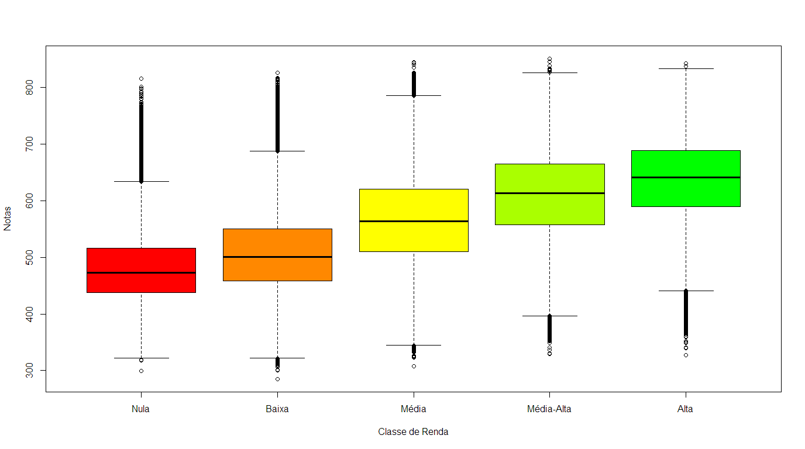
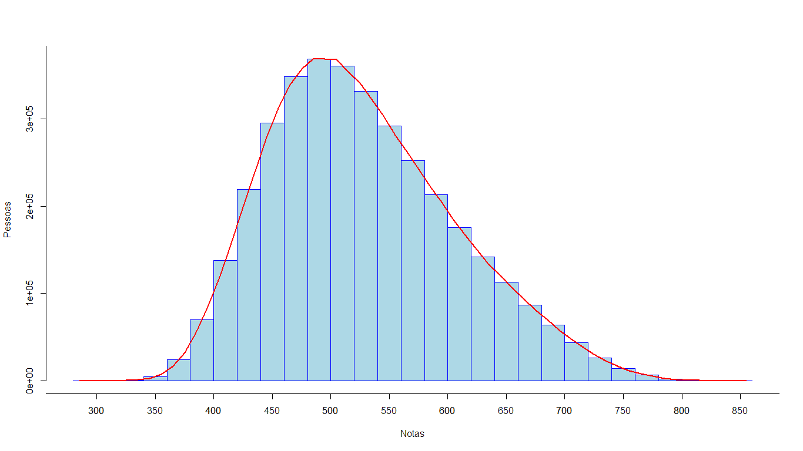

# Análise de MQA: ENEM

# :one: Fase 1 - ANOVA
Foi escolhido uma base de dados providenciada pelo INEP. O INEP publica todos os anos todos os chamados **microdados** que envolvem todos os participantes no exame do ENEM. 

Posteriormente, foi escolhido duas variáveis para praticar a análise: _Classe de Renda_ e _Média Final_ na prova. 

Utilizamos a ferramenta de análise ANOVA para verificar a relação entre a classe de renda e as notas dos alunos.

A IDE principal utilizada foi o R Studio, que disponibiliza um ambiente de trabalho para realizar organizações, cálculos e testes nos dados. 

### Dataset

Abaixo há dois gráficos que visualizam a distribuição das notas e a performance dos alunos conforme a categoria de renda.

### ANOVA
Para utilizar a ANOVA, é importante que as variáveis escolhidas passem em dois testes principais, o **Teste de Normalidade** e o **Teste de Homoscedasticidade**. O teste da ANOVA pressupõe a aprovação da hipótese nula nesses dois testes, para que a conclusão da ANOVA faça sentido.

### Teste de Normalidade
O teste de normalidade, como o próprio nome diz, realiza uma análise nas observações de uma variável para julgar se as observações seguem uma **distribuição normal**.

### Teste de Homoscedasticidade
O teste de homoscedasticidade analisa se as variâncias na variável independente quantitativa são relativamente iguais entre os diferentes grupos, com um certo nível de significância.
Para o nosso caso, esse teste dirá se as variâncias das notas nas diferentes classes de renda são razoavelmente iguais. 

### Teste Final F

O último teste que será feito é o estipulado pela própria ANOVA. O teste F ditará se as médias das notas dos diferentes grupos é igual ou não, a um certo nível de significância.
É importante ressaltar que o teste F só faz sentido quando os dois testes anteriores são aprovados.

### Conclusão
A conclusão da análise é que o modelo utilizado (ANOVA) é inapropriado para esse tipo de situação. Isto é, para provarmos que há sim uma relação, seria necessário o uso de outro modelo com outras fórmulas.

O modelo se mostrou inapropriado por falhar os dois testes principais, que são pré-requisitos para utilizar a ANOVA:
* O teste de normalidade
* O teste de homoscedasticidade
